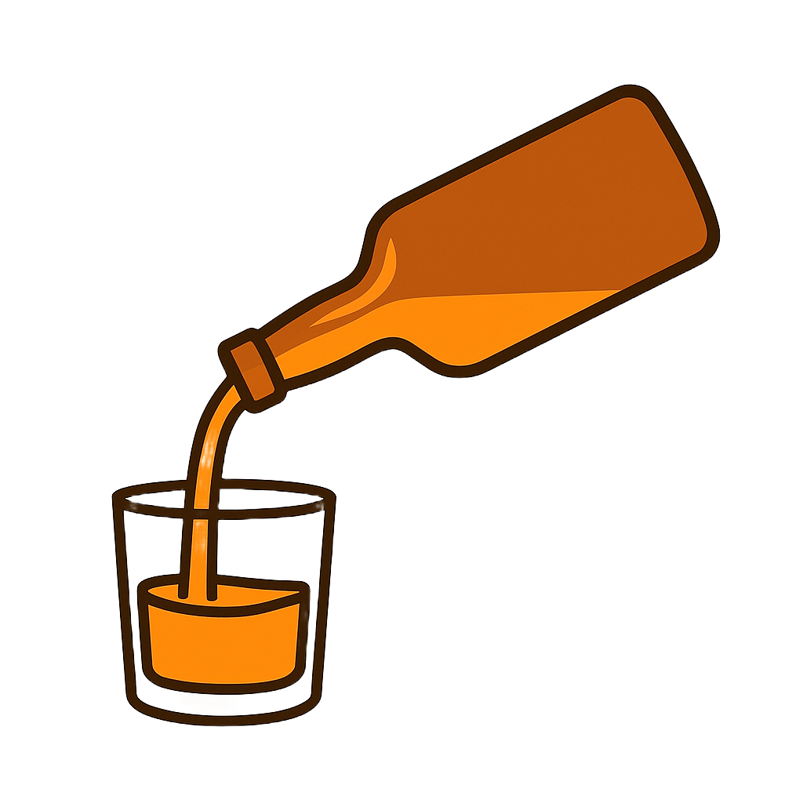

# Nook-Pour

<div align="center">

[](https://opensource.org/licenses/MIT)

</div>

<div align="center">

  <p align="center">
        <br />
    <a href="">
      
    </a><br />
    Brought to you by Drew Andersen<br />
    <a href="https://github.com/Drew-Andersen/Nook-Pour"><strong>Explore the docs »</strong></a>
    <br />
    <br />
    <a href="https://github.com/Drew-Andersen/Nook-Pour">View Demo(Broken)</a>
    ·
    <a href="https://github.com/Drew-Andersen/Nook-Pour">Report Bug</a>
    ·
    <a href="https://github.com/Drew-Andersen/Nook-Pour">Request Feature</a>

  </p>
</div>

<details>
  <summary>Table of Contents</summary>
  <ol>
    <li>
      <a href="#about-the-project">About The Project</a>
      <ul>
        <li><a href="#tech-stack">Built With</a></li>
      </ul>
    </li>
    <li>
      <a href="#getting-started">Getting Started</a>
      <ul>
        <li><a href="#installation">Installation</a></li>
      </ul>
    </li>
    <li><a href="#usage">Usage</a></li>
    <li><a href="#roadmap">Roadmap</a></li>
    <li><a href="#contributing">Contributing</a></li>
    <li><a href="#license">License</a></li>
    <li><a href="#contact">Contact</a></li>
    <li><a href="#acknowledgments">Acknowledgments</a></li>
  </ol>
</details>

## About The Project

**Nook & Pour** is a full-stack cocktoil discovery app that allows users to:

- Select ingredients that have on hand
- View drinks they can make
- Explore new cocktail recipes

The application currently pulls data from a Flask backend (`app.py`) and is structured to later integrate with a SQL database.

### Tech Stack:

### Frontend

- React
- React Router
- React Bootstrap
- JavaScript (ES6+)

### Backend

- Python
- Flask
- REST API architecture

### Planned Backend Upgrade

- SQL Database (PostgreSQL or SQL Lite)

### Development Tools

- npm
- VS Code
- Cit & GitHub

## Getting Started

### Local Installation / Testing

1. Clone the rep

``` bash
git clone git@github.com:Drew-Andersen/Nook-Pour.git
cd Nook-Pour
```

2. Backend Setup (Flask)

``` bash
cd server
python3 -m venv venv
source venc/bin/activate # For Mac or Linux
pip install requirements/txt
python app.py
```

The Flask API should now be running at:

    http://localhost:5000

3. Frontend Setup (React)

Open a new terminal:

``` bash
cd client
npm install
npm start
```

The React app should run at:

    http://localhost:3000

## Usage

1. Navigate to the Ingredients page
2. Select available ingredients
3. Click **View Drinks**
4. See matching cocktails

## Roadmap

### ✅ MVP

-   [x] Ingredient selection UI
-   [x] Drinks view page
-   [x] Flask API integration
-   [ ] Error handling improvements
-   [ ] Clean UI polish

### 🔐 Authentication (Planned)

-   [ ] User registration
-   [ ] Login system
-   [ ] Protected routes

### 🗄 Database Integration

-   [ ] Replace static data in `app.py`
-   [ ] SQL database setup

### 🌟 Future Enhancements

-   [ ] 404 Page
-   [ ] Save favorite drinks
-   [ ] Deploy application


## Contributing

Contributions are what make the open source community such an amazing place to learn, inspire, and create. Any contributions you make are **greatly appreciated**.

If you have a suggestion that would make this better, please fork the repo and create a pull request. You can also simply open an issue with the tag "enhancement".
Don't forget to give the project a star! Thanks again!

1. Fork the Project
2. Create your Feature Branch 
``` bash
git checkout -b feature/AmazingFeature
```
3. Commit your Changes 
``` bash
git commit -m 'Add some AmazingFeature'
```
4. Push to the Branch 
``` bash
git push origin feature/AmazingFeature
```
5. Open a Pull Request


## License

This project is licensed under the MIT license.

See `LICENSE.txt` for more information.


## Contact

**Drew Andersen** <br />
[GitHub](https://github.com/Drew-Andersen) <br />
[Email](andrewtandersen@gmail.com) <br />
 

## Project Links:

[Github Repository](https://github.com/Drew-Andersen/Nook-Pour)

[Deployment- link later]()
